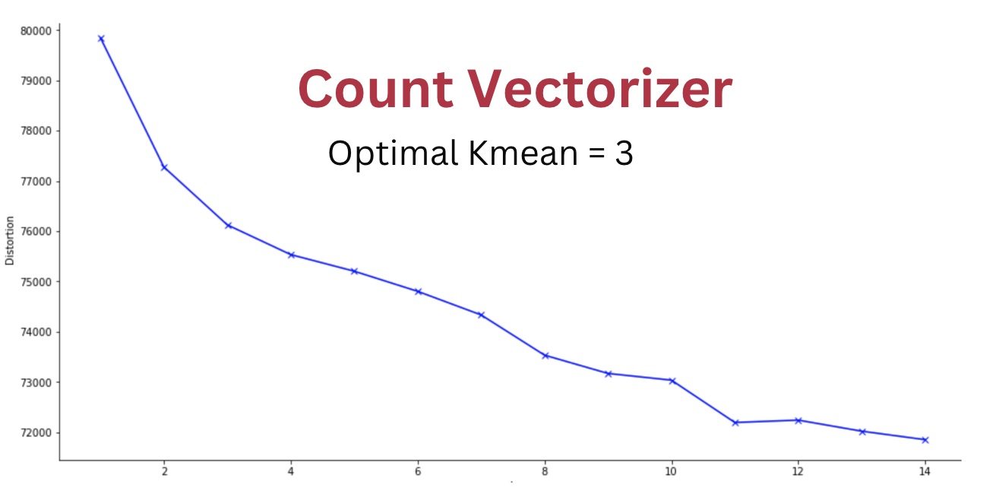

# TOKYO OLYMPICS 2020 (tweets)

## 🟡 Goals:

We chose to study Tokyo Olympics 2020 because of two main reasons. First, in the Olympics there are many different countries and sports, so we expect to see a variety of comments which potentially can give us different clusters. Also, Tokyo Olympics was pushed back one year and took place without the presence of fans. Hence, we were curious to see if this caused people to talk about this occurrence as well.

## 🟡 Preprocessing Data:

The team has decided to use Twitter as the source of information and below are the steps we performed to gather the tweets:

### 1. Get a query using **snscrape** library from Twitter.
-The **snscrape** library is a famous scraper for social networking services that scrapes information like: User profile, searches, and hashtags. For this project, we chose to scrape searches by getting a query.
-To get the query, we used the keywords-  "Olympics Tokyo" and filtered all the tweets to be in english, from July 27 - August 6, 2021.
### 2. Scrape 5000 most recent tweets.
-We have decided to set the limit of the tweets to 5000 because the more, the merrier.
### 3. Clean the data and remove duplicates.
-We have removed the duplicates in the dataset because people were tweeting the same things a couple of times. The rows dropped from 5000 to 4854.
### 4. Clean the tweets using nltk library.
-**Natural Language Tool Kit (nltk)** library contains text processing libraries that cleans the words in the sentences.
-We have set the words into lower case, removed the punctuation marks and characters, removed all emojis, dropped stopwords(unimportant and meaningless words) and removed the keywords "Olympics Tokyo" from the sentences.
### 5. Save the tweets as csv file.
 

## 🟡 Vectorizer Models:
We worked with three vectorizer models in the project to get the best results.

### 1. Count Vectorizer
-This method converts all text data into numerical data. It basically transforms the text according to its frequency or its number of occurence in the text.

### 2. Tfidf Vectorizer
-This method focuses on providing importance to the words and also its frequency in the text to better normalize the data.

### 3. Pre-trained Vectorizer  - ("glove-twitter-25")
-The **glove-twitter-25** is an algorithm that has 25 dimensional representation that has 1.2 Million vocabulary and 27B tokens as unique vectors. Basically, this method represents words as vectors.

Now that we have defined our models, we have fitted and transformed our data and used the machine learning model **k-means clustering** to group or cluster the data. WCSS Method (Elbow Method) is used to get the number of clusters for each model.

### ELBOW METHOD 

We also used **Principal Component Analysis** (PCA) which is a famous unsupervised learning technique to reduce the dimensionality of the data. It also helps to better visualize the data
Example : For Count Vectorizer, the original data contained 4854 rows x 11991 columns and after PCA it reduced to 4854 rows x 2 columns.

## 🟡 Visualizations:

## 🟡 Interpretation:

We used three models to estimate our results. The third model is actually the best one in terms of the performance. Therefore, we decided to use that model to interpret our results. After doing the elbow method, we decided to go with three clusters.

#### Results

The first cluster (which had the most number of tweets as well), mostly includes tweets that were about the results of the games, the eventual champion, or winner of an important game. The most frequent words in this cluster were, for example, gold, silver, bronze and medal. As a result, we labeled this cluster 'Results'

#### Indian Hockey Team

Also, Tokyo Olympics was the first time after over 40 years that Indian Hockey Team won a medal in the Olympics. Additionally, we know that India is one of the most populated countries in the world. Therefore, it is not a surprise that the second cluster was mostly about the Indian Hockey Team and the medal they have won after such a long time. The most frequent words in this cluster were, to name a few, India, Hockey, Indian Hockey and bronze.

#### Olympic Gossips

Unlike the first two clusters, the third one did not consists of meaningful tweets. The tweets in this cluster were mostly about random topics, most of which were not related to the Olympics at all. Therefore, we labeled this cluster 'Olympics Gossips'.

